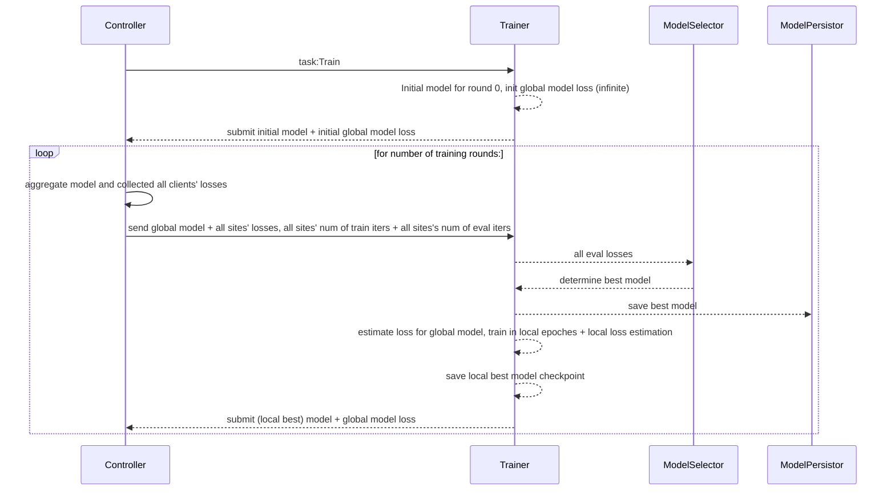

```mermaid
sequenceDiagram
Controller ->>  Trainer: task:Train
Trainer   -->> Trainer: Initial model for round 0, init global model loss (infinite)
Trainer  -->>  Controller: submit initial model + initial global model loss
 
loop for number of training rounds:

    Controller ->>  Controller: aggregate model and collected all clients' losses 
    Controller ->>  Trainer: send global model + all sites' losses, all sites' num of train iters + all sites's num of eval iters
    Trainer   -->> ModelSelector: all eval losses 
    ModelSelector   -->> Trainer: determine best model
    Trainer   -->> ModelPersistor: save best model
    Trainer   -->> Trainer: estimate loss for global model, train in local epoches + local loss estimation
    Trainer   -->> Trainer: save local best model checkpoint
    Trainer   -->>  Controller: submit (local best) model + global model loss
end


```